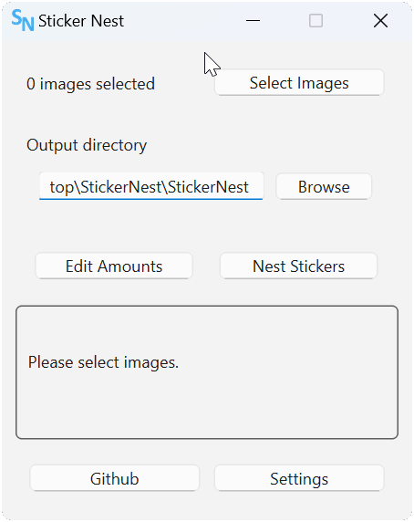

# StickerNest

StickerNest is an app designed to help you place stickers on a sticker sheet in an optimized manner, all automated. It also provides you with SVG cutting lines for use with cutting machines.

It can also be used to place images in a bin for any other purposes.

## Usage Tips

The margin setting refers to the space between the cutting line and other cutting lines. Padding refers to the distance between the cutting line and the actual image.

The app finds your sticker by removing transparent background. Ensure that you remove the background around your image or it will be included!

The output bin size can be customized in millimeters. Using the dpi settings the size and quality of the stickers on the resulting image can be modified.

## UI Preview

## Planned Features

- Setting amounts of individual stickers.